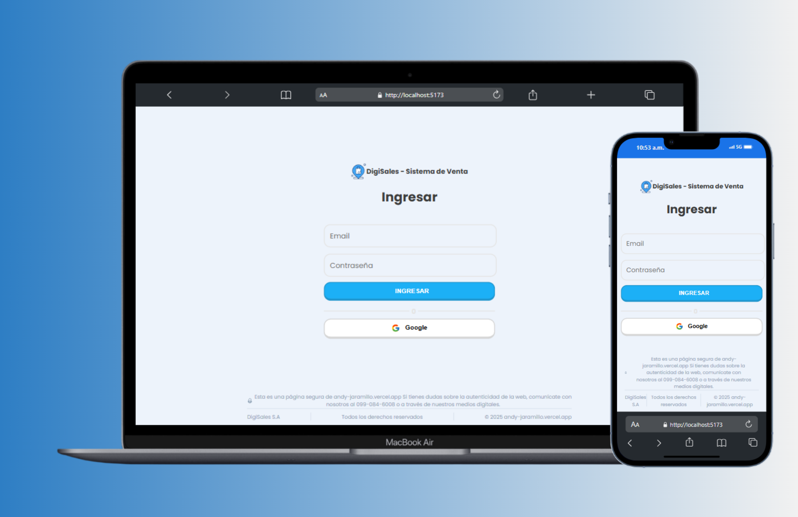
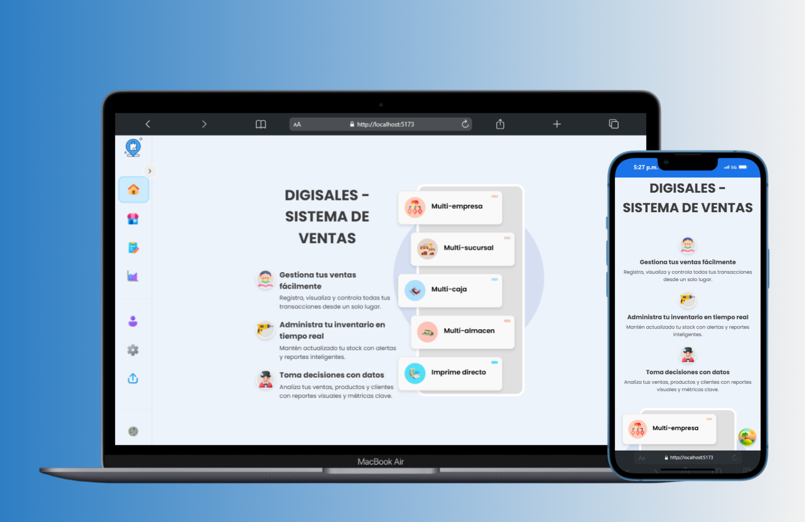

# 🛒 DigiSales Platform

<div align="center">


### 🚀 **Sistema de Ventas Inteligente | AICODIGI**

*Plataforma completa full-stack para gestión integral de ventas y comercio*

**Desarrollado por Andy Jaramillo** - Tecnólogo Full Stack

[](https://github.com/Isracraxcker/DigiSales)


</div>

---

## 🎯 Descripción del Proyecto

**DigiSales** es una plataforma completa de gestión comercial diseñada para revolucionar la forma en que los negocios manejan sus ventas. Combina tecnología moderna con una interfaz intuitiva para ofrecer una solución integral que abarca desde la gestión de inventario hasta la generación de reportes avanzados.

### ✨ Características Principales

<table align="center">
<tr>
<td align="center"><strong>🛒 Ventas Inteligentes</strong></td>
<td align="center"><strong>📦 Gestión de Inventario</strong></td>
<td align="center"><strong>👥 CRM Avanzado</strong></td>
<td align="center"><strong>📊 Reportes en Tiempo Real</strong></td>
</tr>
<tr>
<td>• Facturación rápida y precisa<br>• Múltiples métodos de pago<br>• Sistema de descuentos automático<br>• Procesamiento de devoluciones</td>
<td>• Control de stock en tiempo real<br>• Alertas de inventario bajo<br>• Gestión de códigos de barras<br>• Tracking de productos por SKU</td>
<td>• Base de datos completa de clientes<br>• Historial de compras detallado<br>• Gestión de créditos y abonos<br>• Segmentación de clientes</td>
<td>• Dashboard analítico interactivo<br>• Reportes exportables (PDF/Excel)<br>• Métricas de rendimiento<br>• Análisis de tendencias de venta</td>
</tr>
</table>

---

## 🏗️ Arquitectura y Stack Tecnológico

### **Frontend**
- 🎨 **Styled Components** - Diseño modular y responsivo  
- 🔄 **Zustand** - Gestión de estado eficiente
- 📊 **Chart.js & React-Chartjs-2** - Visualización de datos avanzada
- 🎯 **JavaScript** - Desarrollo con seguridad de tipos

### **Backend & Base de Datos**
- 🛡️ **Supabase** - Backend-as-a-Service completo
- 🗄️ **PostgreSQL** - Base de datos relacional robusta
- 🔧 **Database Functions & Triggers** - Lógica de negocio automatizada
- 🔐 **Row Level Security (RLS)** - Seguridad a nivel de datos
- 🚀 **Real-time Subscriptions** - Actualizaciones en tiempo real

### **Infraestructura & DevOps**
- ☁️ **Vercel** - Despliegue y hosting optimizado
- 📈 **Vercel Analytics** - Métricas de rendimiento
- 🔄 **GitHub Actions** - CI/CD automatizado


---

## 🚀 Instalación y Configuración

### 📋 Prerrequisitos

```bash
Node.js >= 18.0.0
npm >= 9.0.0 (o yarn >= 1.22.0)
Git >= 2.30.0
```

### 🔧 Configuración Step-by-Step

#### 1️⃣ **Clonar el Repositorio**

```bash
git clone https://github.com/Isracraxcker/DigiSales.git
cd DigiSales
```

#### 2️⃣ **Instalar Dependencias**

```bash
# Usando npm (recomendado)
npm install

# Alternativas
yarn install
pnpm install
```

#### 3️⃣ **Configuración de Variables de Entorno**

Crea un archivo `.env` en la raíz del proyecto:

```bash
# Supabase Configuration
VITE_APP_SUPABASE_URL= ...
VITE_APP_SUPABASE_ANON_KEY= ...

```

#### 5️⃣ **Iniciar el Servidor de Desarrollo**

```bash
npm run dev
```

🎉 **¡Listo!** La aplicación estará disponible en [http://localhost:5173](http://localhost:5173)

---

## 🛠️ Scripts Disponibles

| Comando | Descripción | Uso Recomendado |
|---------|-------------|-----------------|
| `npm run dev` | 🔥 Servidor de desarrollo con hot-reload | Desarrollo local |
| `npm run build` | 🏗️ Build optimizado para producción | Pre-despliegue |
| `npm run start` | 🚀 Servidor de producción | Testing de build |
---

## 🌐 Despliegue en Producción

### **Despliegue en Vercel (Recomendado)**

1. **Conectar con GitHub**
   ```bash
   # Instalar Vercel CLI
   npm i -g vercel
   
   # Deploy
   vercel --prod
   ```

2. **Configurar Variables de Entorno**
   - Accede al dashboard de Vercel
   - Ve a Settings > Environment Variables
   - Agrega todas las variables de `.env`

3. **Configurar Dominio Personalizado** (Opcional)
   - En Vercel Dashboard > Domains
   - Agregar tu dominio personalizado

### **Otras Opciones de Despliegue**

<div align="center">

| Plataforma | Dificultad | Escalabilidad | Costo | Recomendado Para |
|------------|:----------:|:-------------:|:-----:|:----------------:|
| 🔺 **Vercel** | ⭐ Fácil | ⭐⭐⭐ Alta | 💰 Freemium | Startups, MVPs |
| ☁️ **AWS** | ⭐⭐⭐ Compleja | ⭐⭐⭐⭐ Muy Alta | 💰💰 Variable | Empresas grandes |
| 🌊 **Netlify** | ⭐⭐ Fácil | ⭐⭐ Media | 💰 Freemium | Proyectos pequeños |


</div>

---

## 📱 Capturas de Pantalla

<div align="center">

### Login Principal


### Presentación del Sistema DigiSales


### Sistema de Ventas


</div>

---

---

## 📄 Licencia

Este proyecto está bajo la Licencia MIT. Ver el archivo [LICENSE](LICENSE) para más detalles.

---

## 🆘 Soporte y Contacto

¿Necesitas ayuda? Aquí tienes varias opciones:

- 📧 **Email:** andyisraeljaramillo@gmail.com
- 💼 **LinkedIn:** [Andy Jaramillo](https://linkedin.com/in/andyjaramillo)

### 🗄️ **Script de Base de Datos**

¿Necesitas el script completo de la base de datos para PostgreSQL/Supabase?

**💡 Obtén acceso al script completo por solo $2 USD**
- 📋 **Incluye:** Todas las tablas, funciones, triggers y configuraciones RLS
- 🚀 **Setup completo:** Listo para importar en tu proyecto
- 🛡️ **Seguridad:** Configuraciones de seguridad a nivel de fila implementadas


[](https://buymeacoffee.com/andyisraela)

*Una vez realizada la compra, recibirás el script completo en tu email en menos de 24 horas.*

---

## 👨‍💻 Sobre el Desarrollador

<div align="center">

### **Andy Jaramillo**
*Tecnólogo Full Stack | Especialista en React & Next.js*

[](https://github.com/Isracraxcker)
[](https://linkedin.com/in/andyjaramillo)
[](https://andy-jaramillo.vercel.app/)
[](mailto:andyisraeljaramillo@gmail.com)

*"Transformando ideas en experiencias digitales excepcionales"*

</div>

---

<div align="center">

### 🌟 **¡Gracias por usar DigiSales Platform!**

*Si este proyecto te resulta útil, no olvides darle una ⭐ en GitHub*

**¿Te gusta el proyecto?** 
- ⭐ **Dale una estrella** al repositorio
- ☕ **Apóyame con un café** en [Buy Me a Coffee](https://buymeacoffee.com/andyisraela)
- 🗄️ **Obtén el script de BD completo** por solo $2 USD

---

<sub>Hecho con ❤️, ☕ y mucho código por Andy Jaramillo | © 2025 DigiSales Platform</sub>

</div>